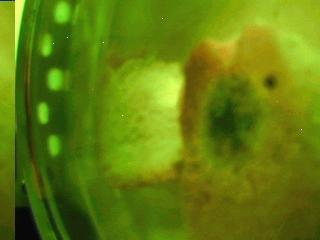
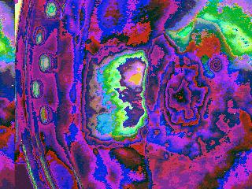

# Camera OV7670 via arduino

## About
This project make photo using OV7670 model and send it into Serial port.  
It's possible to configurate image properties in file  `src/ExampleUart.cpp`  
To get images fill in the firmware into Arduino Uno and afterwards run `read_img_from_serial.py`

## Pinout
- Power supply
  - 3.3V -> 3.3V
  - GND -> GND
- Camera Control Bus (SCCB) - I2C interface
  - SIOC -> A5 (with 10k pull-up resistors)
  - SIOD -> A4 (with 10k pull-up resistors)
- Camera settings
  - Reset -> 3.3V (Reset Signal. Active low.)
  - PWDN -> GND (Power Down Mode Selection. Active high.)
- Getting image dependencies
  - VSYNC -> D2 (Vertical Sync Output – Low during frame)
  - HREF -> none (Horizontal Reference – High during active pixels of 1 row)
  - XCLK -> D12 (Pixel Clock Output – Data is valid on rising edge)
- DCMI (Digital Camera Interface) - 8-bit Video Component Digital Output
  - D0-D3 -> A0-A3 
  - D4-D7 -> D4-A7

## Images examples
  

## Used sources
- [Tutorial](https://circuitjournal.com/arduino-OV7670-to-pc)
- [Git source](https://github.com/indrekluuk/LiveOV7670)